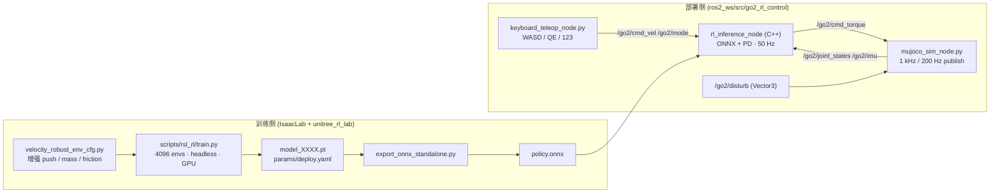

# ros2_go2_rl_demo

> 基于 IsaacLab 训练 Unitree **Go2** 四足机器人强化学习运动策略，并在 **ROS 2 Humble + MuJoCo** 中实现端到端 sim2sim 部署，支持键盘遥控（前进 / 平移 / 转向 / 站立 / 被动）与外部冲量抗干扰测试。

[](https://docs.ros.org/en/humble/)
[](LICENSE)
[](#changelog)

仓库主页：<https://github.com/hjjYUDA/ros2_go2_rl_demo>

---

## 1. 快速预览



**已经验证（v1.0，模型 `model_4999`）：**
- `STAND` 模式：50 Hz 力矩稳定输出，左右对称、量级合理
- `WALK` 模式 `vx=0.5 m/s`：在 MuJoCo 中实际前进约 **2.55 m**，机体高度保持 ~0.31 m
- 抗干扰：施加 **5 N·s** 冲量，机器人保持站姿（z 不下塌）

---

## 2. 仓库结构

```
ros2_go2_rl_demo/
├── README.md                     # 顶层说明（你正在看的）
├── INSTALL.md                    # 详细安装与部署要求
├── CHANGELOG.md                  # 版本演进
├── LICENSE                       # MIT
├── docs/                         # 总体说明与架构
│
├── ros2_ws/src/go2_rl_control/   # ROS 2 部署包（ament_cmake）
│   ├── CMakeLists.txt / package.xml
│   ├── src/rl_inference_node.cpp           # 加载 ONNX + PD 输出力矩
│   ├── scripts/mujoco_sim_node.py          # MuJoCo 桥（1 kHz）
│   ├── scripts/keyboard_teleop_node.py     # 键盘 → /go2/cmd_vel /go2/mode
│   ├── scripts/refresh_policy.sh           # 训练后导出+刷新+colcon build
│   ├── scripts/wait_train_then_refresh.sh  # 监听训练结束自动刷新
│   ├── launch/sim.launch.py                # mujoco_sim + rl_inference
│   ├── description/mujoco/                 # mujoco_menagerie/unitree_go2 MJCF
│   ├── policy/policy.onnx                  # v1 训练的最终策略
│   ├── policy/deploy.yaml                  # 观测/动作/joint 映射
│   └── docs/实现与应用指南.md               # 节点/话题/常见问题
│
└── unitree_rl_lab/                # 训练侧补丁（覆盖到上游 unitree_rl_lab 仓库）
    ├── tasks/velocity_robust_env_cfg.py    # 增强 push/mass/friction 任务
    ├── tasks/__init__.py                   # 注册 Unitree-Go2-Velocity-Robust
    └── scripts/
        ├── play_keyboard.py                # IsaacSim 内键盘演示
        └── export_onnx_standalone.py       # 无需 IsaacSim 导出 ONNX
```

> **训练侧的代码是「补丁」式的**：克隆 `unitree-rl-lab/unitree_rl_lab` 后，把 `unitree_rl_lab/tasks/*.py` 放入
> `source/unitree_rl_lab/unitree_rl_lab/tasks/locomotion/robots/go2/`，把 `unitree_rl_lab/scripts/*.py` 放入 `scripts/rsl_rl/` 即可。详见 [INSTALL.md](INSTALL.md)。

---

## 3. 启动（已编译，已 source）

```bash
# 终端 A：MuJoCo + 推理（注意：不要在 conda env 里运行）
conda deactivate || true
source /opt/ros/humble/setup.bash
source ~/ros2_go2_rl_demo/ros2_ws/install/setup.bash
ros2 launch go2_rl_control sim.launch.py rl_mode:=stand visualize:=true

# 终端 B：键盘遥控
conda deactivate || true
source /opt/ros/humble/setup.bash
source ~/ros2_go2_rl_demo/ros2_ws/install/setup.bash
ros2 run go2_rl_control keyboard_teleop_node.py
```

操作：`2` 切到 WALK，`W/S/A/D/Q/E` 加减速，`1` 站立，`3` 被动，`Space` 清零。

抗干扰测试（任意终端）：

```bash
ros2 topic pub --once /go2/disturb geometry_msgs/msg/Vector3 "{x: 5.0, y: 0.0, z: 0.0}"
```

---

## 4. 安装与部署

请阅读 **[INSTALL.md](INSTALL.md)**，里面分别列出：

- 操作系统 / GPU 驱动 / CUDA 要求
- ROS 2 Humble、ONNX Runtime、MuJoCo Python、yaml-cpp / Eigen 的安装
- IsaacLab + unitree_rl_lab 训练环境（Conda）
- 编译、运行、跨主机查看的最小步骤
- v1 验证清单（visualize / topic hz / 抗干扰）

常见环境坑（Conda 与 ROS 共存）请参见 `ros2_ws/src/go2_rl_control/docs/实现与应用指南.md` 中的「六点六、`GLIBCXX_3.4.30 not found`」。

---

## 5. 技术要点

- **关节顺序**：所有 ROS 话题统一使用 Unitree SDK 顺序  
  `FR_hip → FR_thigh → FR_calf → FL_* → RR_* → RL_*`
- **`joint_ids_map`** 含义按上游 `unitree_rl_lab` 定义：`joint_ids_map[asset_idx] = sdk_idx`，推理节点据此双向重排观测与动作
- **PD 控制** 在 SDK 顺序上做：`tau = stiffness*(q_des - q) - damping*dq`
- **观测向量** 严格按 `deploy.yaml` 中 `observations` 的顺序 / `scale` / `clip` 拼接：
  `base_ang_vel(3) + projected_gravity(3) + velocity_commands(3) + joint_pos_rel(12) + joint_vel_rel(12) + last_action(12) = 45`

---

## 6. Changelog

详见 [CHANGELOG.md](CHANGELOG.md)。

- **v1.0** (2026-04-29)：首个端到端可复现版本。完成训练任务、ONNX 导出、ROS 2 包、MuJoCo 桥、键盘遥控、抗干扰接口、文档与一键脚本。

---

## 7. 参考内容

- [unitree-rl-lab/unitree_rl_lab](https://github.com/unitree-rl-lab/unitree_rl_lab)：Go2 RL 训练任务与 deploy 元数据约定
- [google-deepmind/mujoco_menagerie](https://github.com/google-deepmind/mujoco_menagerie)：Unitree Go2 MJCF 与 mesh
- [NVIDIA/IsaacLab](https://github.com/isaac-sim/IsaacLab)：训练框架
- [Microsoft/onnxruntime](https://github.com/microsoft/onnxruntime)：C++ 推理

## 8. License

[MIT](LICENSE)。第三方资源（MJCF / meshes 等）保留原许可，详见 LICENSE 文件附注。
